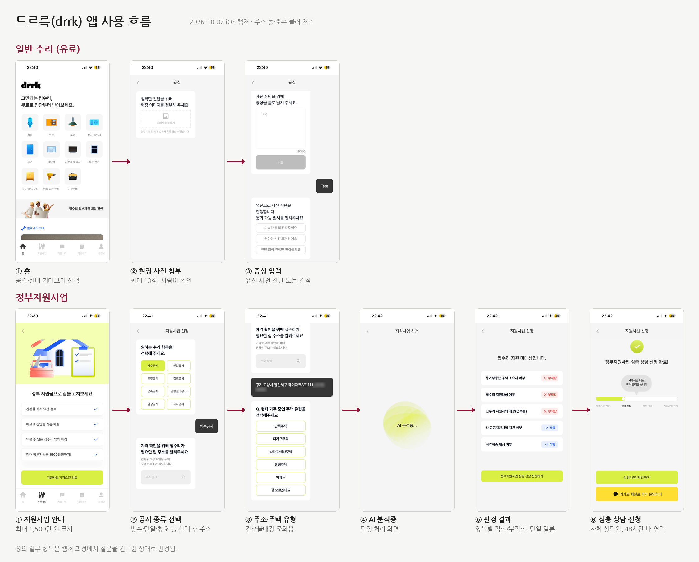

# Jipgyeol (집결)

> Take a photo of a problem in your home, and AI recognizes it and connects you to the home-repair support programs you may qualify for, all the way to counseling

[한국어](README.md)

[](https://doi.org/10.5281/zenodo.23088350)

A project by **Wolgyedonghaeng** (Team 9), 2026 Kwangwoon University KW Hackathon.

- Topic area: Barrier-free and everyday convenience
- Written: October 1, 2026 (support programs and income thresholds as of 2026)
- Status: Planning and prototype design (MVP in development)

---

## At a glance

**One photo is all it takes.** If water is leaking from your bathroom ceiling, just take a picture of it. Jipgyeol recognizes the problem and, using a few simple questions and building-register data, finds the Seoul, Nowon-gu, and national home-repair programs you may qualify for, then summarizes everything on a card you can take to counseling.

```
1. Snap  →  2. Confirm  →  3. Receive
```

| Step | What the resident does | What Jipgyeol does |
|---|---|---|
| 1. Snap | Takes a photo of the problem | AI identifies the problem type (leak, mold, and so on) |
| 2. Confirm | Answers "Is this a leak?" and a few simple questions | Looks up the building's age from the building register automatically |
| 3. Receive | Gets the matching support programs and a counseling prep card | Points to where to go for counseling |

Example: A 72-year-old homeowner in a detached house takes a photo of the bathroom ceiling, answers "Is this a leak?" and two or three questions, then receives the home-repair programs that may apply (for example, Housing Benefit Repair and Maintenance or Hope Home Repair) and a counseling prep card to bring to the Wolgye 1-dong community service center.

---

## Why

Nowon-gu is one of the Seoul districts with a high concentration of aging houses ([Seoul Shinmun, Dec 29, 2025](https://go.seoul.co.kr/news/newsView.php?id=20251229020004)), and Wolgye 1-dong has many older residents and old houses. Old houses bring both everyday discomfort and safety risks: leaks, mold, drafty windows, door sills, and slippery bathrooms. Yet residents often miss out on available support because:

- **They do not know which programs exist.** Home-repair support is spread across the national government, the Seoul Metropolitan Government, Nowon-gu, and public agencies, each with different names, conditions, and application periods.
- **They cannot easily tell whether they qualify.** Income thresholds are based not on wages but on "recognized income", which converts assets into income, so residents cannot calculate it themselves. Housing-benefit status, building age, and ownership or tenancy must also be checked in each announcement, and some programs exclude recipients of other programs.
- **Search does not match how they think.** Existing services ask users to search by program name or category. Residents know the problem ("water is leaking from the bathroom ceiling"), not the program name.
- **Digital access is hard.** Older residents in particular struggle to collect and compare information across several websites.

## Who it is for

| User | Need |
|---|---|
| Residents of aging houses (especially older adults and people with limited digital skills) | Find support they can receive from the problem alone, without knowing program names |
| Helpers (family members, neighborhood representatives, neighbors) | Check quickly on a resident's behalf and help prepare for counseling |
| Counselors at the community service center | Receive residents who already have the needed information organized, shortening counseling time |

## How it works

Jipgyeol starts from **the problem in the home**, not from a policy name. Residents see three steps (1. Snap, 2. Confirm, 3. Receive), and the following happens behind them:

```
1. Snap: take a photo → AI classifies the problem type
2. Confirm: confirm the AI result + simple questions (housing data looked up automatically)
3. Receive: match support programs → counseling prep card → guidance to counseling and application
```

### 1. Snap

- When a resident photographs the part of the house that needs repair, AI assigns it to one of a fixed set of problem types, such as leak, mold, window draft/insulation, heating, or safety (door sills, grab bars, slippery floors).
- The type becomes a search keyword for finding support programs.

### 2. Confirm

- The app shows the AI's judgment ("This looks like a leak. Is that right?") and lets the resident confirm it or choose a different type. If the AI is not confident, the app suggests counseling first.
- The resident then answers a few simple questions: age, housing type, and owner or tenant.
- Building age and approval date come from the public building register, so the resident does not need to enter them.
- Income is never asked as an exact amount. Instead, simple questions come first:

| Order | Question | What it tells us |
|---|---|---|
| 1 | "Do you receive the housing benefit?" | At or below 48% of the standard median income. Owner-occupiers qualify for Repair and Maintenance; excluded from Hope Home Repair |
| 2 | "Are you a basic livelihood recipient or in the near-poverty group?" | Roughly at or below 50%. May qualify for Hope Home Repair and Energy Efficiency Improvement |
| 3 | Household size and "Which range is your monthly household income in?" (buttons) | The 60% and 100% brackets. May qualify for the Safe Home Repair Grant and Hope Home Repair |

If the answer to question 1 or 2 is "yes", the following questions are skipped. Every question has an "I'm not sure" option; choosing it still shows the programs but adds "income and asset criteria to be checked at counseling" to the prep card. Bracket amounts are listed in [docs/support-programs-research-2026.md](docs/support-programs-research-2026.md) (Korean).

### 3. Receive

- The app matches support programs using a problem-type keyword mapping table and a synonym dictionary (for example, grouping "dripping", "leak", and "ceiling stain" as the same problem).
- What is confirmed and what still needs checking are summarized on a one-page counseling prep card.
- The app guides the resident to the Wolgye 1-dong community service center or the relevant agency for counseling and application.

## Programs we connect to (as of 2026)

| Program | Operator | Main eligibility | Related problem types |
|---|---|---|---|
| Safe Home Repair Grant (안심 집수리 보조사업) | Seoul | Vulnerable households at or below 100% of median income in low-rise houses 10+ years old, semi-basement units, rooftop units, and others | Windows, insulation, heating, waterproofing, accessibility and fire-safety fixtures |
| Safe Home Repair Loan (안심 집수리 융자) | Seoul | Low-rise houses 20+ years after approval | Most types |
| Hope Home Repair (희망의 집수리) | Seoul, applied through community service centers | At or below 60% of median income (housing-benefit recipients excluded) | Wallpaper and flooring, insulation, grab bars, sill removal, anti-slip bathroom floors, and more |
| Housing Benefit Repair and Maintenance (주거급여 수선유지급여) | Ministry of Land, Infrastructure and Transport; LH | Owner-occupier households at or below 48% of median income | Light, medium, and major repairs |
| Energy Efficiency Improvement for Low-Income Households (저소득층 에너지효율개선) | Ministry of Trade, Industry and Energy; Korea Energy Foundation | Basic livelihood recipients, near-poverty households, and others | Insulation, windows, boilers, air conditioners |
| Nowon-gu home repair support | Nowon-gu | Low-income households | Under verification |

Conditions, amounts, application periods, and sources for each program are in [docs/support-programs-research-2026.md](docs/support-programs-research-2026.md) (Korean).

## What is different

| | Existing approaches | Jipgyeol |
|---|---|---|
| Starting point | Search by program name or category (Bokjiro, Seoul home-repair portal), or proactive notices based on administrative data (Welfare Membership) | **The actual condition of the home**, as residents see it |
| Eligibility check | Read announcements and decide yourself | Simple questions plus automatic building-register lookup |
| Outcome | Ends with information | A counseling prep card that leads to actual counseling and application |

Administrative data knows a household's income and composition, but it cannot tell whether the roof is leaking today. Jipgyeol fills this gap with a resident's photo and a few answers.

### Compared with private home-repair apps

Some private apps now combine a government-support eligibility check with contractor matching. We tried a representative one, Drrk (드르륵), on October 2, 2026.

| | Private home-repair app (Drrk) | Jipgyeol |
|---|---|---|
| Starting point for finding support | Choosing a type of construction work (waterproofing, insulation, windows, and so on) | A photo of the problem or plain words ("water is leaking from the ceiling") |
| Role of photos | Checked by staff in the paid repair flow | AI classifies the problem type to find support programs |
| Result | Eligible or not eligible | Programs that may apply, one by one, with reasons, sources, and reference dates |
| Next step | In-house consultation and contractor matching | Counseling at the community service center (public connection) |

Jipgyeol starts from the problem, so residents do not have to translate it into construction terms such as "waterproofing work". The app's screen flow is documented in [docs/related-services/drrk-2026-10-02](docs/related-services/drrk-2026-10-02/) (Korean screenshots).



## Built to be trusted

**Showing why a program was suggested**
- Each suggested program comes with the conditions behind it, for example "You may qualify because you own the house and it was built more than 20 years ago."
- Each program shows a link to the original announcement and the date of the information.
- Programs whose application period has passed are not hidden; the app says "You can apply in the next round."

**The AI and the app do not make the decision**
- AI only selects the problem type. Program matching uses curated program data and rules.
- Results say "you may qualify", not "you qualify", and final eligibility is decided by the counseling agency.

**Handing off to people when stuck**
- If the AI is not confident or no program matches, the app directs the user to counseling at the Wolgye 1-dong community service center.
- If the building-register lookup fails, the app switches to manual input.
- Tenant households are told in advance that landlord consent may be required.
- Residents outside the service area see a notice and are redirected to Bokjiro.

## Counseling prep card

| Item | Example |
|---|---|
| Problem | Bathroom ceiling leak (photo attached) |
| Confirmed conditions | Age 72, owner-occupied, detached house, approved in 1985 |
| Conditions to check | Income and asset criteria, housing-benefit status |
| Programs that may apply | Program name, operator, application period |
| Documents to prepare | Per program |
| Where to go | Wolgye 1-dong community service center contact and hours |

The card is shown on screen; printing and text-message delivery are under review.

## Easy mode (barrier-free)

So that older residents can use the app on their own, the design follows these principles. Because Jipgyeol is a mobile app, it primarily follows the Korean mobile application content accessibility guidelines, and also refers to the Korean Web Content Accessibility Guidelines (KWCAG 2.2) and WCAG 2.2:

- Large text and sufficient color contrast
- Large, easy-to-tap buttons
- Plain language instead of administrative terms ("the year the house was finished" instead of "approval date", "monthly household income" instead of "recognized income")
- A 1-2-3 progress indicator showing which step the user is on
- Step-by-step screens with one task per screen, and a way back at every step
- Choosing the problem from an illustrated list instead of a photo (under review)
- Voice guidance (under review)

## Privacy principles (under review)

- Income is asked only as a range, never as an exact amount.
- Location metadata (EXIF) is removed from photos before processing.
- Original photos are not stored by default.
- Users are informed on screen before any photo is sent to an external AI service.

## Evaluation plan

We plan to run usability evaluations with Wolgye 1-dong residents to check whether they can actually find the support programs they need and prepare for counseling.

## Operating model (under review)

- **Operator:** We envision a public-service model in which Nowon-gu and the Wolgye 1-dong community service center adopt the app as a tool for guiding residents. Residents use it for free.
- **Running costs:** The main costs are AI calls for photo classification and updating program information and income thresholds, which change every year, once or twice a year.
- **Benefits for the administration:** When residents arrive with a counseling prep card, counselors do not need to ask about every condition from scratch, which shortens counseling. Cases with no matching program are also filtered out in advance.

## Tech stack (under review)

- App: React Native
- Server: FastAPI
- AI: Multimodal AI for photo classification (outputs a fixed problem type and a confidence score)
- Data: Public data APIs including the building register, curated data on Seoul, Nowon-gu, and national home-repair programs, and the standard median income table

## Timeline

| Period | Work |
|---|---|
| Sep 29 to Oct 3 | Core features: photo-based problem classification, program matching, counseling prep card |
| Oct 4 to Oct 8 | MVP: automatic housing information lookup, easy mode |

## Future plans

- **Expanding to other areas:** Keep photo classification and matching rules as they are, and swap only the regional program data to extend the service to other neighborhoods and districts.
- **Managing program data:** Keep original announcements and reference dates together, and set up a process to update information in line with application periods and the standard median income announced each year.
- **Reflecting resident feedback:** Refine screens and questions based on usability evaluations with Wolgye 1-dong residents.

## Getting started

To be added as development progresses.

## Project structure

To be added as development progresses.

## Team Wolgyedonghaeng

| Role | Name |
|---|---|
| Planning | Haneul Kim |
| Backend | Dongjin Choi |
| Frontend | Jihwan Yoon |
| Design | Siyeon Kim |

## Contact

For questions about the project, please contact us through the team repository or a team member.

## Citation

Please cite this project using its Zenodo record.

- DOI: [10.5281/zenodo.23088350](https://doi.org/10.5281/zenodo.23088350)

## License

- Code: [GNU Affero General Public License v3.0 only](LICENSE) (SPDX: `AGPL-3.0-only`)
- Documentation (README and `docs/`): [Creative Commons Attribution 4.0 International](https://creativecommons.org/licenses/by/4.0/) (CC BY 4.0)
- Exception: screenshots of other services in `docs/related-services/` are copyright of their operators, quoted for comparison, and are not covered by CC BY 4.0.

---

This document is a draft describing the idea and design direction, and it may change as development progresses. Items marked "(under review)" are still being decided by the team.
