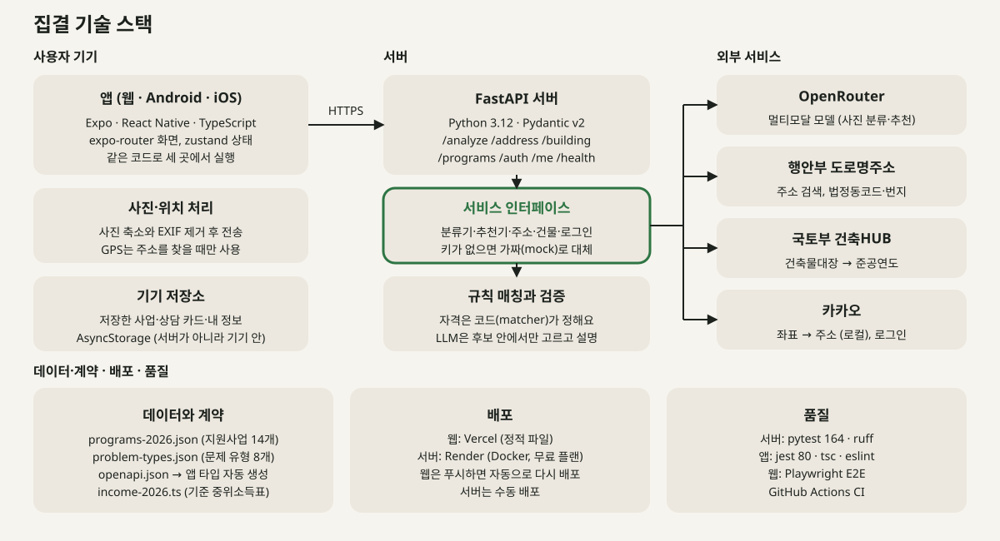

# Jipgyeol (집결)

> Take a photo of a problem in your home, and AI recognizes it and connects you to the home-repair support programs you may qualify for, all the way to counseling

[한국어](README.md)

[](https://doi.org/10.5281/zenodo.23088350)

A project by **Wolgyedonghaeng** (Team 9), 2026 Kwangwoon University KW Hackathon.

- Topic area: Barrier-free and everyday convenience
- Last updated: October 8, 2026 (program data as of October 6, 2026; income thresholds based on the 2026 standard median income)
- Status: **MVP complete and deployed** (web, Android, and iOS from one codebase; no resident evaluation has been run yet)

Results are guidance on programs you "may qualify for"; the app does not determine eligibility.

---

## Summary

- **Why we build it:** Residents of aging homes often miss out on support because they cannot tell which programs exist or whether they qualify. Existing services start from policy names, but all a resident knows is "water is leaking from the ceiling."
- **Who it is for:** Residents of aging homes (especially older adults), the family members, neighborhood leaders, and neighbors who help them, and the staff who counsel at the community center.
- **How it solves it:** One photo identifies the problem type, a few easy questions plus a building-register lookup check the conditions, and the app finds programs you may qualify for and carries you through to a counseling prep card. Rules decide eligibility; AI only classifies the problem and ranks within the candidates.

**One photo is all it takes.** If water is leaking from your bathroom ceiling, just take a picture of it. Jipgyeol recognizes the problem and, using a few simple questions and building-register data, finds the Seoul, Nowon-gu, and national home-repair programs you may qualify for, then summarizes everything on a card you can take to counseling.

```
1. Snap  →  2. Confirm  →  3. Receive
```

| Step | What the resident does | What Jipgyeol does |
|---|---|---|
| 1. Snap | Takes a photo of the problem | AI identifies the problem type (leak, mold, and so on) |
| 2. Confirm | Answers "Is this a leak?" and a few simple questions | Looks up the building's age from the building register automatically |
| 3. Receive | Gets the matching support programs and a counseling prep card | Points to where to go for counseling |

Example: A 72-year-old homeowner in a detached house takes a photo of the bathroom ceiling, answers "Is this a leak?" and two or three questions, then receives the home-repair programs that may apply (for example, Housing Benefit Repair and Maintenance or Hope Home Repair) and a counseling prep card to bring to the Wolgye 1-dong community service center.

## Problem definition and analysis

Nowon-gu is one of the Seoul districts with a high concentration of aging houses ([Seoul Shinmun, Dec 29, 2025](https://go.seoul.co.kr/news/newsView.php?id=20251229020004)), and Wolgye 1-dong has many older residents and old houses. Old houses bring both everyday discomfort and safety risks: leaks, mold, drafty windows, door sills, and slippery bathrooms. Yet residents often miss out on available support because:

- **They do not know which programs exist.** Home-repair support is spread across the national government, the Seoul Metropolitan Government, Nowon-gu, and public agencies, each with different names, conditions, and application periods.
- **They cannot easily tell whether they qualify.** Income thresholds are based not on wages but on "recognized income", which converts assets into income, so residents cannot calculate it themselves. Housing-benefit status, building age, and ownership or tenancy must also be checked in each announcement, and some programs exclude recipients of other programs.
- **Search does not match how they think.** Existing services ask users to search by program name or category. Residents know the problem ("water is leaking from the bathroom ceiling"), not the program name.
- **Digital access is hard.** Older residents in particular struggle to collect and compare information across several websites.

### Compared with existing services

| | Existing approaches | Jipgyeol |
|---|---|---|
| Starting point | Search by program name or category (Bokjiro, Seoul home-repair portal), or proactive notices based on administrative data (Welfare Membership) | **The actual condition of the home**, as residents see it |
| Eligibility check | Read announcements and decide yourself | Simple questions plus automatic building-register lookup |
| Outcome | Ends with information | A counseling prep card that leads to actual counseling and application |

Administrative data knows a household's income and composition, but it cannot tell whether the roof is leaking today. Jipgyeol fills this gap with a resident's photo and a few answers.

#### Compared with private home-repair apps

Some private apps now combine a government-support eligibility check with contractor matching. We tried a representative one, Drrk (드르륵), on October 2, 2026.

| | Private home-repair app (Drrk) | Jipgyeol |
|---|---|---|
| Starting point for finding support | Choosing a type of construction work (waterproofing, insulation, windows, and so on) | A photo of the problem or plain words ("water is leaking from the ceiling") |
| Role of photos | Checked by staff in the paid repair flow | AI classifies the problem type to find support programs |
| Result | Eligible or not eligible | Programs that may apply, one by one, with reasons, sources, and reference dates |
| Next step | In-house consultation and contractor matching | Counseling at the community service center (public connection) |

Jipgyeol starts from the problem, so residents do not have to translate it into construction terms such as "waterproofing work". The app's screen flow is documented in [docs/related-services/drrk-2026-10-02](docs/related-services/drrk-2026-10-02/) (Korean screenshots).


## Target users

| User | Need |
|---|---|
| Residents of aging houses (especially older adults and people with limited digital skills) | Find support they can receive from the problem alone, without knowing program names |
| Helpers (family members, neighborhood representatives, neighbors) | Check quickly on a resident's behalf and help prepare for counseling |
| Counselors at the community service center | Receive residents who already have the needed information organized, shortening counseling time |

## Solution

Jipgyeol starts from the **problem with the home**, not from policy names. Residents see three steps: Snap, Confirm, Receive. The screens and the server processing are covered in "User flow" and "Server processing flow" below.

### The three steps residents see

#### 1. Snap

- When a resident photographs the part of the house that needs repair, AI assigns it to one of a fixed set of problem types, such as leak, mold, window draft/insulation, heating, or safety.
- The type is matched against the kinds of work each program supports.

#### 2. Confirm

- The app shows the AI's judgment ("This looks like a leak. Is that right?") and lets the resident confirm it or choose a different type. If the AI is not confident, the app suggests counseling first.
- The resident then answers a few simple household questions. Income is chosen from amount-range buttons that match the household size, never typed as an exact amount.
- The address is found from the phone's location (GPS) and confirmed with "Is this the right address?"; if location is unavailable, the resident types a road address.
- Building age and approval date come from the public building register, so the resident does not need to enter them.

| Question | What it tells us |
|---|---|
| "How many people live together?" | Household size; the income ranges below are shown for that size |
| "About how much does your family earn per month in total?" (4 buttons) | Ranges cut at 48%, 60%, and 100% of the standard median income (table below) |
| "Do you receive the housing benefit?" (only when income is at or below 48%) | Owner-occupiers who receive it are guided to Repair and Maintenance and excluded from other repair programs |
| "What kind of home do you live in?" | Owned, jeonse or monthly rent, or public rental |
| "Tap everything that applies" | A member aged 65+, a member with a disability, basic livelihood or near-poverty status |

Every question has an "I'm not sure" option; choosing it still shows the programs but adds "income criteria including assets to be checked at counseling" to the prep card.

#### 3. Receive

- Programs that fit are listed simply by name and amount; tapping one shows the reasons, how to apply, and sources.
- What is confirmed and what still needs checking are summarized on a one-page counseling prep card.
- The app guides the resident to the Wolgye 1-dong community service center or the relevant agency for counseling and application.

### Income ranges

Jipgyeol never asks for an exact income. It asks the resident to pick one of 4 ranges cut at **48%, 60%, and 100%** of the 2026 standard median income (`app/src/config/income-2026.ts`). Program income criteria are 48%, 60%, 65%, or 100%, so these three cut points sort most programs. The amounts depend on household size, so the screen asks for the household size first and prints that size's amounts on the buttons. Monthly amounts for 1 to 4 people, rounded to 10,000 won (man-won):

| Household | Standard median income (monthly) | Range 1 (up to 48%) | Range 2 (48 to 60%) | Range 3 (60 to 100%) | Range 4 (over 100%) |
|---|---|---|---|---|---|
| 1 person | 2,564,238 won | up to 1.23M won | 1.23M to 1.54M | 1.54M to 2.56M | over 2.56M |
| 2 people | 4,199,292 won | up to 2.02M won | 2.02M to 2.52M | 2.52M to 4.20M | over 4.20M |
| 3 people | 5,359,036 won | up to 2.57M won | 2.57M to 3.22M | 3.22M to 5.36M | over 5.36M |
| 4 people | 6,494,738 won | up to 3.12M won | 3.12M to 3.90M | 3.90M to 6.49M | over 6.49M |

- Many program criteria use "recognized income", which converts assets into income, so these ranges are only a rough guide; the exact decision is made at counseling.
- 5 to 7 people are calculated the same way. For 8 or more, the 7-person values are used and the screen adds "to be checked at counseling".
- The bracket amounts and per-program income criteria are in [docs/support-programs-research-2026.md](docs/support-programs-research-2026.md) (Korean).

### Programs we connect to (14, as of 2026)

Program data lives in [server/data/programs-2026.json](server/data/programs-2026.json) with sources and a reference date (2026-10-06), and the app shows only these values. Eligibility candidates are decided by code rules (`server/services/matcher.py`); the AI only orders and explains the programs that remain as candidates. The application status below is as of the reference date; check the original announcement and the agency before applying.

| id | Program | Type | Operator | Key conditions (income and others) | Support | Application status |
|---|---|---|---|---|---|---|
| C01 | Housing Benefit Repair and Maintenance | In-kind | Ministry of Land, Infrastructure and Transport; LH (inspection and repair); Nowon-gu Office (benefit decision) | At or below 48% of median income (recognized income); owner-occupier | Up to 16.01M won by repair scope (0 to 20% self-pay depending on income) | Open all year |
| C02 | Energy Efficiency Improvement for Low-Income Households (heating/cooling) | In-kind | Ministry of Climate, Energy and Environment; Korea Energy Foundation; Nowon-gu Office (intake and referral) | Basic livelihood recipients, near-poverty households, or low-income households referred by the local government (no median-income percentage) | Average 2.43M won, up to 3.3M won (no self-pay) | Heating until the budget runs out; current status to be checked |
| C03 | Green Remodeling Interest Support for Private Buildings | Loan (interest support) | Ministry of Land, Infrastructure and Transport; Green Remodeling Center of the Korea Authority of Land and Infrastructure Safety | No income criterion; owner; approved before 2016 | Interest support of 4.5 to 5.5% on construction loans (up to 100M won loan for detached houses) | First come, first served until the budget runs out; current status to be checked |
| S01 | Hope Home Repair | In-kind | Seoul Housing Welfare Division; districts; contractors selected by Seoul | At or below 60% of median income | Up to 2.5M won (no self-pay) | 2026 first and second rounds closed |
| S02 | Safe Home Repair Grant | Grant | Seoul Residential Environment Improvement Division; Nowon-gu Office | Owner, low-rise housing. Vulnerable-household type: at or below 100% of median income; basement, rooftop, and designated-zone types: no income criterion | 50 to 80% of construction cost, up to 12M won | 2026 regular round closed |
| S03 | Safe Home Repair Loan | Loan | Seoul Metropolitan Government; Nowon-gu Office (intake); Shinhan Bank; Korea Housing Finance Corporation | No income criterion; owner, low-rise housing, 20 years or older | Up to 80% of construction cost at 0.7% a year (up to 60M won for detached houses) | Application period to be checked |
| S04 | Saebit Housing (building energy efficiency subsidy) | Grant | Seoul Climate and Environment Headquarters; Seoul Low-Carbon Building Support Center | No income criterion (higher rate for low-income households); 15 years or older | 70 to 90% of construction cost, up to 5M won for detached houses | 2026 round closed (budget used up) |
| S06 | Housing Accessibility Support for Low-Income People with Disabilities | In-kind | Seoul Independent Living Support Division for People with Disabilities | Persons with disabilities; recipients and near-poverty (50% or below): fully supported; up to 65%: 30% self-pay | Up to 10M won (average about 3.4M won) | 2026 round closed (recruits in Feb to Mar each year) |
| N01 | Nowon-gu Low-Income Home Repair (small repairs) | In-kind | Nowon-gu Welfare Policy Division; Nowon-gu Home Repair Center | Basic livelihood, near-poverty, and other low-income households. Whether a 60% median-income criterion applies differs between documents, so it needs checking | Up to 1M won (no self-pay) | Current status to be checked |
| N02 | Winter Home Energy Consulting | Checkup service | Nowon-gu Welfare Policy Division; Nowon-gu Home Repair Center | No income criterion (Nowon-gu residents) | Free (thermal imaging and consultation; repairs are not included) | 2026 round closed |
| N03 | Nowon-gu Apartment Complex Support | Information | Nowon-gu Apartment Support Division | Applied for by the apartment complex (management body) | Up to 30M won per complex (common areas only) | 2026 round closed |
| N04 | Living-Environment Improvement for Hoarding Households | Information | Nowon-gu Welfare Policy Division | Not confirmed | Removing accumulated items and cleaning (not repair work) | Intake method to be checked |
| N05 | Free Flood-Prevention Installation | In-kind | Nowon-gu Office | Not confirmed | Free installation | Operating; details to be checked in the announcement |
| N06 | Housing Stability Support by In-Home Elder Care Agencies | In-kind | Nowon-gu in-home elder care agencies | Vulnerable seniors aged 65+; income criterion not confirmed | Goods and work fully supported (no self-pay) | Recruitment timing differs by agency; to be checked |

- Types: "In-kind" means repair work or goods are provided; "Grant" means part of the construction cost is paid as a subsidy; "Loan" means borrowed money that must be repaid (including interest support); "Checkup service" and "Information" programs do not pay for repairs. The results screen tells users "This is a loan, not a grant".
- N03 and N04 are not home-repair programs, so they are shown as information only.
- Each program's phone number is included only where it was confirmed in the announcement; otherwise the app falls back to the Wolgye 1-dong community service center. Conditions, amounts, application periods, and sources for each program are in [docs/support-programs-research-2026.md](docs/support-programs-research-2026.md) and [docs/support-programs-research-2-2026.md](docs/support-programs-research-2-2026.md) (Korean).
- The data is built from the Excel source (`server/data/support-programs-2026.xlsx`) by `server/data/build_programs.py`. The eligibility rules are structured fields in that script, written by a person after review.

### Counseling prep card

On a program's detail screen, "Make card" creates a one-page card to take to the counseling desk. It can be saved or shared as an image, and it is stored on the device so it can be reopened from the home screen.

| Item | Example |
|---|---|
| Program | Program name, where to apply, phone number |
| Application status | Apply anytime, application period to be checked, and so on |
| Our home | Household size, monthly income range, housing benefit, owner or tenant, neighborhood, the year of completion, problem type (photo thumbnail) |
| To check | Income criteria including assets, and other program-specific items |

The card does not include a name or detailed address, only the neighborhood. Printing and text-message delivery are under review.

### Built to be trusted

**Showing why a program was suggested**
- Each suggested program comes with the conditions behind it, for example "You may qualify because you own the house and it was built more than 20 years ago."
- Each program shows a link to the original announcement and the date of the information.
- Programs whose application period has passed are not hidden; the app says "You can apply in the next round."

**The AI and the app do not make the decision**
- AI only selects the problem type. Program matching uses curated program data and rules.
- Results say "you may qualify", not "you qualify", and final eligibility is decided by the counseling agency.

**Handing off to people when stuck**
- If the AI is not confident or no program matches, the app directs the user to counseling at the Wolgye 1-dong community service center.
- If the building-register lookup fails, the app switches to manual input.
- Tenant households are told in advance that landlord consent may be required.
- Residents outside the service area see a notice and are redirected to Bokjiro.

## User flow

The top row is the user screens, the bottom row is the server processing, and the arrows mark where external data comes in.


Each screen does one thing, and the user can go back a step at any point.

| Screen | The one thing it does | When something fails |
|---|---|---|
| Home | Take a photo of the problem or pick one from the album (up to 3). Photos are shrunk and re-saved on the device first. The top bar has login, my info, and screen brightness (auto, light, dark); below it are the saved programs and counseling cards. | If the camera or album cannot be used, the app points to the other option. If a photo cannot be loaded, the user picks again. |
| Household | Answer five simple questions: "How many people live together?", "About how much does your family earn per month in total?" (4 range buttons), "Do you receive the housing benefit?" (only when income is at or below 48%), "What kind of home do you live in?", and "Tap everything that applies". Every question has an "I'm not sure" option. If information was saved before, the app first asks "Start with your saved information?" | Unknown answers are fine; programs stay visible and the item is kept as something to check at counseling. |
| Address | Find the address from the phone's location (GPS) and confirm "Is this the right address?", or type a road address and pick it. Once the address is set, the building age is looked up from the building register automatically. Unit number is optional. | If location permission is blocked or the address is not found, the screen switches to manual input. If the building-register lookup fails, it says "We'll check the year of completion at counseling". For an address outside Nowon-gu it shows a notice and points to Bokjiro, and the user can still continue. |
| Searching | Sends the photo and answers to the server and waits. If it takes long, it says "This is taking a little longer". | Shows "We couldn't find anything right now" with [Try again] and [Call the community service center]. |
| Results | First tells the user what problem the AI saw. If confidence is low it asks "This looks like a leak. Is that right?" ([Yes] or [No, let me choose]), and then lists programs by name and amount only. Selection buttons at the top (All, Can apply, Apply later, Needs checking) filter the list by application status. Programs left out can be viewed with reasons under "Look at other programs". | If the photo alone is unclear ("other"), the user picks the problem type from an illustrated list. If nothing matches, it says "We couldn't find anything with these conditions" and points to the community service center. On an error it shows [Try again] and [Call the community service center]. |
| Program detail | Shows what is supported, the amount, who it is for (income, year of completion, area, other conditions), "why you may qualify", application status and period, how to apply, a phone number, what to check or prepare at counseling, source links, and the reference date. The bottom bar has save, make card, and call. | If a program has no phone number, the Wolgye 1-dong community service center number is shown instead. If the program cannot be found, a back button is shown. |
| Counseling card | Makes a one-page card to bring to the counseling desk. It can be saved or shared as an image, and the user can call the application office directly. Created cards stay on the device. | If saving or sharing fails, the app suggests the other way. Leaving the card without saving an image shows a login prompt once (closing it continues; "Don't show again" is also available). |
| Saved list on Home | Reopen saved programs and created cards. | When empty it says "No saved programs yet". |
| My info | Edit and save the home location and household information, and change screen brightness. Login is optional, and Kakao login receives only the nickname. On logout the user chooses whether to keep or delete the saved programs and cards on the device. | If the upload to the server fails, the data is still saved on the device and the app says so. If the login has expired, it asks the user to log in again. |

## Server processing flow

The app sends the photos, household, address, and building information to `POST /analyze`, and the server (`server/services/analyze.py`) processes them in this order:

1. **Problem-type classification.** The photo is classified into one of 8 fixed types (leak, mold, window draft/insulation, heating/boiler, plumbing/fixtures, safety, electric, other) with a confidence score. If confidence is below 0.7, or the type is "other", the response is marked as needing confirmation and the app shows the confirmation step. If the user picked the type themselves, classification is skipped.
2. **Rule matching.** `server/services/matcher.py` compares the 14 programs with the household, address, and building and gives each condition a pass, unknown, or fail. One fail removes the program from the candidates (the reason is returned separately); an unknown keeps it as a "may qualify" candidate with a note on what to check at counseling. Only these rules decide the eligibility candidates. For example, an owner-occupier who receives the housing benefit is guided to Repair and Maintenance and removed from other repair programs.
3. **Recommendation.** Among the remaining candidates, the order and a reason sentence are chosen. The default is the rule ranker (a score from problem-type match, application status, and so on, with template reasons). Depending on configuration, an LLM picks the order and a one-sentence reason from the candidates only. The LLM is given a JSON schema that forces the program id to be one of the candidate ids, so it cannot output a program outside the candidates, and it is never asked to judge eligibility. If the LLM ranker fails or times out, the rule ranker takes over and `fallbackUsed` is set in the response.
4. **Validation.** `server/services/validator.py` checks the result. A candidate-external id, a duplicate, or a schema violation replaces the whole result with the rule ranker's. A reason sentence containing a forbidden word ("for sure", "without fail", "you qualify" in Korean) or a number not in the program data is replaced with a template, sentence by sentence. Status, application state, and items to check are always overwritten with the candidate's own values.
5. **Response.** Returns the classification, whether confirmation is needed, the recommendations, free-checkup notices, excluded programs with reasons, and `version` (server git commit, rules and data hash, program reference date, classifier and ranker provider and model, confirmation threshold). Photos are not stored, and the operation log keeps only values such as type, confidence, counts, and timings.

External data comes in as follows:

| Data | Used for |
|---|---|
| Ministry of the Interior and Safety road address search API | Address search, legal-district code and lot number |
| Kakao Local | Turning the phone's location (coordinates) into an address |
| Ministry of Land, Infrastructure and Transport building register (Architecture HUB) | Year of completion (approval date), main use, floor counts |
| `server/data/programs-2026.json` | Rule matching and all program information in the app (amounts, periods, phone numbers, sources) |

## Tech stack



| Area | What we use |
|---|---|
| App | Expo (React Native, expo-router, TypeScript); web, Android, and iOS from one codebase |
| Server | FastAPI (Python 3.12, Pydantic v2) |
| AI | A multimodal model called through OpenRouter. It classifies a photo into a fixed problem type with a confidence score, and orders and explains the remaining candidate programs |
| Public and external data | Ministry of the Interior and Safety road address search API, Ministry of Land, Infrastructure and Transport building register (Architecture HUB), Kakao Local (coordinates to address) and Kakao Login |
| Own data | 14 support programs (`server/data/programs-2026.json`), problem types (`contracts/problem-types.json`), the standard median income table (`app/src/config/income-2026.ts`) |
| Deployment | Web on Vercel, server on Render (Docker) |
| Quality | Server pytest, app jest, web Playwright E2E, GitHub Actions CI (see "Tests and quality" below) |

Every external integration (classifier, ranker, address, building register, login) sits behind an interface, so implementations can be swapped through settings.

## Easy mode (barrier-free)

So that older residents can use the app on their own, the design follows these principles. Because Jipgyeol is a mobile app, it primarily follows the Korean mobile application content accessibility guidelines, and also refers to the Korean Web Content Accessibility Guidelines (KWCAG 2.2) and WCAG 2.2:

- Large text and sufficient color contrast
- Large, easy-to-tap buttons
- Plain language instead of administrative terms ("year of completion" instead of "approval date", "monthly household income" instead of "recognized income")
- A progress indicator with the step number, such as "Step 2 of 3", showing which step the user is on
- Step-by-step screens with one task per screen, and a way back at every step
- If the AI is wrong or unsure, the resident picks the problem type from an illustrated list
- Light and dark modes (following the phone setting, switchable between auto, light, and dark), support for 200% text scaling and reduced motion, and an accessible name on every button
- Voice guidance (under review)

### Design standards (`app/src/ui/tokens.ts`)

Colors, type, and spacing come only from the values in `tokens.ts`; screen code does not hard-code color values.

| Item | Standard |
|---|---|
| Color | Two sets: light (background `#F6F4EE`, text `#1D221E`, accent green `#2E7544`) and dark (background `#121613`, text `#EDF0EA`, accent mint `#79CF8F`). Surface, secondary text, caution color, and line colors exist for each mode |
| Contrast | A test (`tokens.test.ts`) requires token pairs such as text on background and text on the green button to be at least 4.5:1 in both modes |
| Type size | Body 20, label 22, amount 24, title 26, spoken prompt 28, meta 17 (the smallest text). Line height is 1.3 to 1.6 times the size |
| Button size | Primary button height 60, secondary 56, minimum touch target 48, household-size button 72, income button 64 |
| Radius and spacing | Corner radius 10, 16, 24; spacing steps of 8, 12, 16, 20, 24, 32, 48 |
| Web column width | 480 |
| Typeface | Pretendard (Regular, Medium, Bold) |

## Privacy principles

- Income is asked only as a range, never as an exact amount.
- Photos are shrunk and re-saved on the device, which removes location metadata (EXIF), before they are sent. The server does not store photos.
- Server logs do not record photos, addresses, coordinates, or names.
- Saved programs and counseling cards are stored on the device. Login is optional, and Kakao login receives only the nickname. After login, saving "My info" also sends it to the server, but the server keeps it in memory only, so it is lost when the server restarts. Permanent server-side storage is still at the preparation stage.
- Because an external AI service is used for photo classification and recommendations, the home screen tells users once, on first use, that the photo is sent to an external AI service and is not stored on the server.

## Evaluation plan

We plan to run usability evaluations with Wolgye 1-dong residents to check whether they can actually find the support programs they need and prepare for counseling.

## Operating model (under review)

- **Operator:** We envision a public-service model in which Nowon-gu and the Wolgye 1-dong community service center adopt the app as a tool for guiding residents. Residents use it for free.
- **Running costs:** The main costs are AI calls for photo classification and updating program information and income thresholds, which change every year, once or twice a year.
- **Benefits for the administration:** When residents arrive with a counseling prep card, counselors do not need to ask about every condition from scratch, which shortens counseling. Cases with no matching program are also filtered out in advance.

## Tests and quality

These are the numbers we ran and checked on October 8, 2026. The web E2E was not run; its test files were counted instead.

| Area | Tool | Count | What it covers |
|---|---|---|---|
| Server | pytest | 164 passed, 7 skipped | Rule-table tests (`test_matcher.py` with `server/eval/matcher_cases.yaml`), ranker and validator, classifier/address/building, auth, rate limits, API contract tests. The 7 skipped are real-integration checks (`tests/smoke`) that need real keys |
| App | jest | 80 passed (11 files) | Income range calculation, household logic, photo processing, card building, result-row assembly, program detail, storage, login, design-token contrast |
| Web E2E | Playwright | 16 | Full run from Home to the counseling card (light and dark), location permission denied then manual input, confirmation step, "other", empty result, error screen, login and my info |

- GitHub Actions: the server runs `ruff check` and `pytest`; the app runs `tsc --noEmit`, `eslint`, `jest`, and a web export; a separate workflow runs the web E2E.
- App checks run together with `npx tsc --noEmit && npx eslint . && npx jest`.
- Android and iOS real devices have not been checked yet; only the web was verified.

## Timeline

| Period | Work | Status |
|---|---|---|
| Sep 29 to Oct 3 | Core features: photo-based problem classification, program matching, counseling prep card | Done |
| Oct 4 to Oct 8 | MVP: automatic housing information lookup, easy mode, deployment | Done |

## Future plans

- **Reflecting resident feedback:** Run usability evaluations with Wolgye 1-dong residents and refine screens and questions based on the results.
- **Saving personal information on the server:** Today a logged-in user's information is still stored only on the device. Permanent server-side storage is the next step.
- **Voice guidance, card printing and text-message delivery** are under review.
- **Expanding to other areas:** Photo classification and matching rules stay as they are; only the regional program data changes to extend the service to other neighborhoods and districts.
- **Managing program data:** Keep original announcements and reference dates together, and set up a process to update information in line with application periods and the standard median income announced each year.
- **More real-device checks:** Verify camera, phone call, and card saving on more Android and iOS devices.

## Getting started

### Server

```bash
cd server
python -m venv .venv && source .venv/bin/activate
pip install -r requirements.txt
cp .env.example .env            # fill in the keys
uvicorn main:app --reload --port 8000
pytest -q                       # rule-table tests and contract tests
pytest -q tests/smoke -rs       # real-integration checks after adding keys (skipped without keys)
```

`server/.env.example` lists only the variable names: photo classification (`OPENROUTER_*`), addresses (`JUSO_API_KEY`, `KAKAO_REST_KEY`), the building register (`BLDG_API_KEY`), and Kakao Login (`KAKAO_CLIENT_SECRET`, `APP_TOKEN_SECRET`). `.env` files and keys are never committed. While the server runs, `http://localhost:8000/health` shows its status and version information.

### App

```bash
cd app
npm install
cp .env.example .env            # set EXPO_PUBLIC_API_BASE_URL to the server address
npx expo start                  # i: iOS, a: Android, w: web
npx tsc --noEmit && npx eslint . && npx jest
npm run e2e                     # web E2E (includes the build)
```

- To reach the server on your PC from a phone (Expo Go), use the PC's LAN IP instead of `localhost`.
- Camera and location work on the web only over HTTPS or localhost.
- Kakao only redirects back to `http(s)` addresses, so the app returns through a web address (`EXPO_PUBLIC_AUTH_WEB_BASE`) to get back into the app.

### Deployment

- Server: deployed to Render from `render.yaml` at the repository root and `server/Dockerfile`. Secrets are entered as environment variables in the Render dashboard.
- Web: deployed to Vercel with `app/vercel.json` (Root Directory is `app`).

## Project structure

```
app/                          Expo app (web, Android, iOS)
  app/                        screens (expo-router)
    index.tsx                 Home (photo, saved lists)
    household.tsx             Household
    address.tsx               Address
    results.tsx               Searching and results
    program/[id].tsx          Program detail
    card/[id].tsx             Counseling prep card
    profile.tsx               My info
    login-modal.tsx           Login prompt
    auth-callback.tsx         Return screen for Kakao login
  src/
    config/                   copy (copy.ts), income table (income-2026.ts), problem types
    features/                 auth, cards, household, location, photo, profile, programs
    services/                 API, local storage, screen capture
    store/                    screen-flow state
    ui/                       design tokens (tokens.ts), theme, shared parts
  e2e/                        web E2E (Playwright)
  scripts/                    contract sync
server/                       FastAPI server
  main.py settings.py         app start, settings in one place
  version.py limits.py        version info, request size and rate limits
  routers/                    analyze, address, building, programs, health, auth, me
  schemas/                    Pydantic schemas
  services/
    matcher.py                rule matching
    validator.py              recommendation validation
    analyze.py                /analyze processing order
    classifier/               classifier (OpenRouter)
    ranker/                   ranker (LLM, rules)
    address.py building.py    address, building register
    kakao_auth.py             Kakao login
  data/                       programs-2026.json, Excel source, build_programs.py
  db/                         operation log
  eval/                       rule-table test data (matcher_cases.yaml)
  tests/                      pytest (including contract and smoke tests)
  scripts/                    API contract export
contracts/                    API contract (openapi.json) and problem types shared by server and app
docs/                         program research, service flow diagram (flow.svg), logos, records of compared services
.github/workflows/            CI, web E2E
render.yaml                   server deployment config
```

## Open source and data sources

### Open source

The code in this project is AGPL-3.0-only and uses the open-source software below in accordance with their licenses. The full dependency lists are in `app/package.json` and `server/requirements.txt`; each license follows the respective project's repository.

| Name | License | Used for |
|---|---|---|
| Expo, React Native, expo-router, and Expo SDK packages | MIT | The whole app |
| React, react-native-web, react-native-svg, zustand | MIT | Screens, running on the web, graphics and icons, state management |
| FastAPI, Pydantic | MIT | Server |
| Uvicorn, httpx | BSD-3-Clause | Running the server, calling external APIs |
| PyYAML | MIT | Reading rule-table test data |
| Pretendard | SIL Open Font License 1.1 | All text in the app. Full license text in `app/assets/fonts/Pretendard-LICENSE.txt` |
| Feather icons (phone shape) | MIT | The phone button on the program detail screen |
| pytest, Jest, Playwright, ruff | MIT, MIT, Apache-2.0, MIT | Testing and code checks |

### Data and external services

| Source | Used for |
|---|---|
| Ministry of the Interior and Safety road address search API | Address search, legal-dong code and lot number |
| Ministry of Land, Infrastructure and Transport Architecture HUB building register (Public Data Portal) | The year of completion, building use |
| Kakao Local and Kakao Login | Converting coordinates to an address, optional login (Kakao API terms of use) |
| OpenRouter | Calling the AI model used for photo classification and recommendations |
| Program announcements from the Ministry of Land, Infrastructure and Transport, Korea Land and Housing Corporation, Seoul Metropolitan Government, Nowon-gu, Korea Energy Foundation, and Korea Authority of Land and Infrastructure Safety | The content of the 14 support programs. Source links and the reference date for each program are in `server/data/programs-2026.json` |
| Ministry of Health and Welfare notice (2026 standard median income) | Income bracket amounts |

Screenshots of other services quoted for comparison (`docs/related-services/`) are copyright of their operators and are not covered by this project's licenses.

## Team Wolgyedonghaeng

| Role | Name |
|---|---|
| Planning | Haneul Kim |
| Backend | Dongjin Choi |
| Frontend | Jihwan Yoon |
| Design | Siyeon Kim |

## Contact

For questions about the project, please contact us through the team repository or a team member.

## Citation

Please cite this project using its Zenodo record.

- DOI: [10.5281/zenodo.23088350](https://doi.org/10.5281/zenodo.23088350)

## License

- Code: [GNU Affero General Public License v3.0 only](LICENSE) (SPDX: `AGPL-3.0-only`)
- Documentation (README and `docs/`): [Creative Commons Attribution 4.0 International](https://creativecommons.org/licenses/by/4.0/) (CC BY 4.0)
- Exception: screenshots of other services in `docs/related-services/` are copyright of their operators, quoted for comparison, and are not covered by CC BY 4.0.

---

This document reflects the MVP as of October 8, 2026. Program information changes every year, so please check the original announcement and the responsible agency before applying. Items marked "(under review)" are still being decided by the team.
