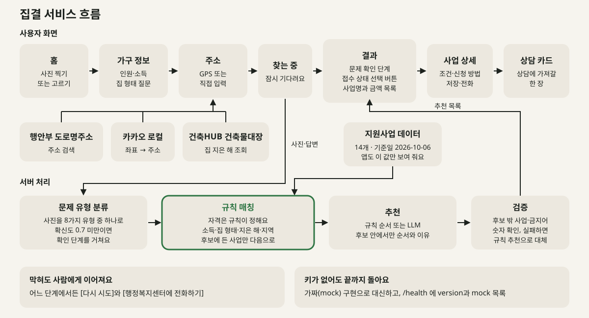

# 집결

> 집 문제를 사진으로 찍으면, AI가 문제를 알아보고 받을 수 있는 집수리 지원사업과 상담까지 연결해 주는 주거복지 서비스

[English](README.en.md)

[](https://doi.org/10.5281/zenodo.23088350)

2026 광운대학교 KW 해커톤 9조 **월계동행**의 프로젝트입니다.

- 주제 분야: 배리어프리·생활편의
- 최종 갱신: 2026년 10월 8일 (지원사업 정보 기준일 2026년 10월 6일, 소득 기준은 2026년 기준 중위소득)
- 상태: **MVP 완성 및 배포** (웹, Android, iOS를 같은 코드로 지원. 실제 주민 평가는 아직 하지 않았습니다)

결과는 "받을 수 있을 수도 있는 사업"을 보여 주는 안내이며, 자격을 판정하지 않습니다.

---

## 한눈에 보기

**사진 한 장이면 됩니다.** 욕실 천장에서 물이 새면 그 자리를 찍기만 하세요. 집결이 문제를 알아보고, 몇 가지 쉬운 질문과 건축물대장 정보로 받을 수 있는 서울시·노원구·정부 집수리 지원사업을 찾아, 상담에 가져갈 카드로 정리해 드립니다.

```
① 찍기  →  ② 확인하기  →  ③ 받기
```

| 단계 | 주민이 하는 일 | 집결이 하는 일 |
|---|---|---|
| ① 찍기 | 문제가 있는 곳을 사진으로 찍어요 | AI가 문제 유형(누수, 곰팡이 등)을 알아봐요 |
| ② 확인하기 | "누수가 맞나요?"와 쉬운 질문 몇 개에 답해요 | 주택 연식은 건축물대장에서 자동으로 찾아요 |
| ③ 받기 | 받을 수 있는 지원사업과 상담 준비 카드를 받아요 | 카드를 들고 갈 상담처까지 안내해요 |

예시: 72세 자가 단독주택 주민이 욕실 천장 사진을 찍으면, "누수가 맞나요?"와 질문 두세 개에 답한 뒤, 해당될 수 있는 집수리 지원사업(예: 주거급여 수선유지급여, 희망의 집수리)과 상담 준비 카드를 받아 월계1동 행정복지센터 상담으로 이어 갑니다.

---

## 왜 만드나요

노원구는 서울에서 노후주택이 많이 모인 자치구 중 하나이고([서울신문, 2025.12.29](https://go.seoul.co.kr/news/newsView.php?id=20251229020004)), 월계1동은 그중에서도 고령 인구와 오래된 주택이 많은 동네입니다. 오래된 집은 누수, 곰팡이, 창문 틈새, 문턱과 미끄러운 욕실처럼 생활 불편과 안전사고 위험이 함께 커집니다. 그런데 문제가 생겨도 다음과 같은 이유로 지원을 받지 못하는 경우가 많습니다.

- **어떤 지원사업이 있는지 모릅니다.** 집수리 지원사업은 국토교통부, 서울시, 노원구, 공공기관별로 흩어져 있고 이름, 조건, 신청 시기가 모두 다릅니다.
- **내가 해당되는지 판단하기 어렵습니다.** 지원사업의 소득 기준은 월급이 아니라 재산까지 소득으로 환산한 "소득인정액"으로 정해져 주민이 직접 계산하기 어렵습니다. 여기에 주거급여 수급 여부, 주택 연식, 자가 또는 임차 여부까지 공고문마다 확인해야 하고, 어떤 사업은 다른 사업의 수급자를 제외하기도 합니다.
- **검색 방식이 맞지 않습니다.** 기존 서비스는 정책 이름이나 분야로 찾아야 합니다. 하지만 주민이 아는 것은 정책 이름이 아니라 "욕실 천장에서 물이 샌다"는 사실입니다.
- **디지털 이용이 어렵습니다.** 고령 주민일수록 여러 누리집을 오가며 정보를 모으고 비교하기 어렵습니다.

## 누구를 위한 서비스인가요

| 사용자 | 필요한 것 |
|---|---|
| 노후주택에 사는 주민 (특히 고령자, 디지털 이용이 어려운 주민) | 정책 이름을 몰라도 집 문제만으로 받을 수 있는 지원을 찾기 |
| 대신 도와주는 사람 (가족, 통장, 이웃) | 주민 대신 빠르게 확인하고 상담 준비를 돕기 |
| 행정복지센터 상담 담당자 | 주민이 필요한 정보를 미리 정리해 와서 상담 시간을 줄이기 |

## 어떻게 해결하나요

집결은 정책 이름 대신 **집의 문제**에서 시작합니다. 주민에게는 ① 찍기, ② 확인하기, ③ 받기의 세 단계로 보이고, 그 뒤에서 아래 그림의 일이 일어납니다. 위 줄은 사용자 화면, 아래 줄은 서버 처리이고, 화살표는 외부 데이터가 들어오는 곳입니다.



### 화면별 흐름

한 화면은 한 가지 일만 합니다. 어느 화면에서든 앞 단계로 돌아갈 수 있습니다.

| 화면 | 하는 일 | 실패하거나 막히면 |
|---|---|---|
| 홈 | 고칠 곳을 사진으로 찍거나 앨범에서 고릅니다(최대 3장). 사진은 앱에서 줄이고 다시 저장한 뒤 씁니다. 위쪽에서 로그인, 내 정보, 화면 밝기(자동·밝게·어둡게)를 바꿀 수 있고, 아래에는 저장한 지원사업과 상담 카드가 보입니다. | 카메라나 앨범을 쓸 수 없으면 다른 방법(앨범, 사진 찍기)을 안내합니다. 사진을 불러오지 못하면 다시 고르게 합니다. |
| 가구 정보 | 쉬운 질문 다섯 가지에 답합니다. "몇 명이 함께 사나요?", "가족이 한 달에 버는 돈은 모두 얼마 즈음이에요?"(금액 구간 버튼 4개), "주거급여를 받고 계세요?"(소득이 48% 이하일 때만), "어떤 집에 사세요?", "해당되는 항목을 모두 눌러 주세요". 모든 질문에 "잘 모르겠어요"가 있습니다. 이전에 저장한 정보가 있으면 "저장된 정보로 시작할까요?"를 먼저 묻습니다. | 모르는 항목은 모른다고 답하면 되고, 사업을 숨기지 않고 상담에서 확인할 것으로 남깁니다. |
| 주소 | 휴대폰 위치(GPS)로 주소를 찾아 "주소가 맞나요?"로 확인하거나, 도로명 주소를 직접 적어 고릅니다. 주소가 정해지면 건축물대장에서 집을 다 지은 해를 자동으로 찾습니다. 동·호수는 선택입니다. | 위치 권한이 막혔거나 주소를 못 찾으면 직접 입력으로 넘어갑니다. 건축물대장 조회에 실패하면 "집을 다 지은 해는 상담에서 확인해요"로 넘어갑니다. 노원구 밖 주소면 안내를 보여 주고 복지로로 안내하며, 그래도 계속 볼 수도 있습니다. |
| 찾는 중 | 사진과 답변을 서버로 보내 결과를 기다립니다. 오래 걸리면 "조금 더 걸리고 있어요"로 알려 줍니다. | "지금은 찾지 못했어요"와 함께 [다시 시도], [행정복지센터에 전화하기]가 나옵니다. |
| 결과 | 먼저 AI가 본 문제를 알려 줍니다. 확신이 낮으면 "누수로 보여요. 맞나요?"를 묻고([맞아요], [아니에요, 고를게요]), 그다음에 사업 목록을 사업명과 금액만으로 보여 줍니다. 위쪽 선택 버튼(전체, 신청 가능, 추후 신청, 확인 필요)으로 접수 상태별로 걸러 볼 수 있습니다. 목록에 없는 사업은 "다른 사업도 살펴볼래요"에서 이유와 함께 볼 수 있습니다. | 사진만으로 알 수 없으면(기타) 그림 목록에서 문제 종류를 직접 고르게 합니다. 맞는 사업이 없으면 "지금 조건으로는 찾지 못했어요"와 행정복지센터 안내가 나옵니다. 오류면 [다시 시도]와 [행정복지센터에 전화하기]가 나옵니다. |
| 사업 상세 | 지원 내용, 지원 금액, 지원 대상(소득, 집을 다 지은 해, 지역, 그 밖의 조건), "받을 수도 있는 이유", 접수 상태와 기간, 신청 방법, 문의 전화, 상담에서 확인하거나 준비할 것, 출처 링크와 정보 기준일을 보여 줍니다. 아래 바에서 저장, 카드 만들기, 전화하기를 누를 수 있습니다. | 담당 번호가 없으면 월계1동 행정복지센터 번호로 대신 안내합니다. 사업 정보를 못 찾으면 돌아가기를 보여 줍니다. |
| 상담 준비 카드 | 상담 창구에 들고 갈 한 장을 만듭니다. 이미지로 저장하거나 보낼 수 있고, 신청처에 바로 전화할 수 있습니다. 만든 카드는 기기에 남습니다. | 이미지 저장이나 보내기에 실패하면 다른 방법을 안내합니다. 이미지를 저장하지 않고 카드에서 나가려 하면 로그인 안내가 한 번 뜹니다(닫으면 이어서 나가고, "다시 보지 않기"도 고를 수 있습니다). |
| 홈의 저장 목록 | 저장한 지원사업과 만든 카드를 다시 열어 봅니다. | 비어 있으면 "아직 저장한 사업이 없어요"를 보여 줍니다. |
| 내 정보 | 사는 곳과 가구 정보를 고쳐 저장하고 화면 밝기를 바꿉니다. 로그인은 선택이고 카카오 로그인은 닉네임만 받습니다. 로그아웃할 때 기기에 저장한 사업과 카드를 남길지 지울지 고릅니다. | 서버에 올리지 못해도 기기에는 저장하고 그렇게 알려 줍니다. 로그인이 풀리면 다시 로그인하게 안내합니다. |

### 서버 처리 흐름

앱이 `POST /analyze`로 사진, 가구 정보, 주소, 건물 정보를 보내면 서버(`server/services/analyze.py`)가 다음 순서로 처리합니다.

1. **문제 유형 분류.** 사진을 정해진 8가지 유형(누수, 곰팡이, 창문 틈새·단열, 난방·보일러, 배관·설비, 안전, 전기, 기타) 중 하나와 확신도로 분류합니다. 확신도가 0.7 미만이거나 "기타"면 응답에 확인이 필요하다고 표시해 앱이 확인 단계를 보여 줍니다. 사용자가 직접 문제 유형을 고른 경우에는 분류를 건너뜁니다.
2. **규칙 매칭.** `server/services/matcher.py`가 지원사업 14개를 가구 정보, 주소, 건물 정보와 견주어, 조건마다 통과, 모름, 탈락을 냅니다. 탈락이 하나라도 있으면 후보에서 빼고(이유를 따로 돌려줍니다), 모름이 있으면 "받을 수도 있는" 후보로 남기고 상담에서 확인할 것을 붙입니다. 자격 후보는 이 규칙만 정합니다. 예를 들어 주거급여를 받는 내 집은 수선유지급여로 안내하고 다른 집수리 사업에서는 뺍니다.
3. **추천.** 남은 후보 안에서 순서와 이유 문장을 정합니다. 기본은 규칙 추천(문제 유형 일치, 접수 상태 등으로 점수를 매긴 순서와 템플릿 이유)이고, 설정에 따라 LLM이 후보 안에서만 순서와 한 문장 이유를 고릅니다. LLM에게는 후보 id 목록을 enum으로 강제하는 JSON 스키마를 주므로 후보 밖 사업 id를 낼 수 없고, 자격을 판정하는 일도 맡기지 않습니다.
4. **검증.** `server/services/validator.py`가 추천 결과를 확인합니다. 후보 밖 id, 중복, 스키마 위반이 있으면 규칙 추천으로 통째로 대체합니다. 이유 문장에 금지어("확실히", "무조건", "해당돼요")나 사업 데이터에 없는 숫자가 있으면 그 문장만 템플릿으로 바꿉니다. 상태, 접수 상태, 확인할 것은 항상 후보의 값으로 덮어씁니다.
5. **응답.** 분류 결과, 확인 필요 여부, 추천 목록, 무료 점검 안내, 제외된 사업과 이유, 그리고 `version`(서버 git 커밋, 규칙·데이터 해시, 지원사업 기준일, 분류기와 추천기 종류·모델, 확인 기준 값)을 돌려줍니다. 사진은 저장하지 않고, 운영 로그에는 유형, 확신도, 개수, 걸린 시간 같은 값만 남깁니다.

**가짜(mock) 구현.** 분류, 추천, 주소, 건축물대장, 카카오 로그인은 모두 인터페이스 뒤에 있습니다. API 키가 비어 있으면 서버가 자동으로 가짜 구현을 쓰므로, 키 없이도 화면 흐름을 처음부터 끝까지 돌려 볼 수 있습니다. `GET /health`가 `version`(위와 같은 버전 정보)과 `mock`(가짜로 동작 중인 부품 목록, 예: `openrouter`, `address`, `building`, `kakao`)을 알려 줍니다. LLM 추천이 실패하거나 시간이 넘으면 규칙 추천으로 대체되고 응답의 `fallbackUsed`에 표시됩니다.

외부 데이터는 다음과 같이 들어옵니다.

| 데이터 | 쓰는 곳 |
|---|---|
| 행정안전부 도로명주소 검색 API | 주소 검색, 법정동코드와 번지 |
| 카카오 로컬 | 휴대폰 위치(좌표)를 주소로 바꾸기 |
| 국토교통부 건축HUB 건축물대장정보 | 집을 다 지은 해(사용승인일), 주 용도, 층수 |
| `server/data/programs-2026.json` | 규칙 매칭과 앱의 모든 사업 정보(금액, 기간, 전화번호, 출처) |

### 주민에게 보이는 세 단계

#### ① 찍기

- 수리가 필요한 곳을 찍으면, AI가 누수, 곰팡이, 창문 틈새·단열, 난방, 안전 같은 정해진 문제 유형 중 하나로 1차 분류합니다.
- 분류된 유형은 지원사업이 지원하는 공사 종류와 맞춰 보는 데 쓰입니다.

#### ② 확인하기

- "누수로 보여요. 맞나요?"처럼 AI의 판단을 보여 주고, 주민이 확인하거나 다른 유형으로 고칠 수 있게 합니다. AI가 확신하지 못하면 상담 연결을 먼저 권합니다.
- 이어서 가구 정보를 몇 가지 쉬운 질문으로 묻습니다. 소득은 정확한 금액이 아니라 가구원 수에 맞춘 금액 구간 버튼으로 고릅니다.
- 사는 곳은 휴대폰 위치(GPS)로 주소를 찾아 "주소가 맞나요?"로 확인하고, 위치를 쓸 수 없으면 도로명 주소를 직접 적습니다.
- 주택 연식과 사용승인일은 건축물대장 공공데이터로 자동 조회하므로 주민이 따로 입력하지 않아도 됩니다.

| 질문 | 알 수 있는 것 |
|---|---|
| "몇 명이 함께 사나요?" | 가구원 수. 아래 소득 구간의 금액을 가구원 수에 맞춰 보여 줍니다 |
| "가족이 한 달에 버는 돈은 모두 얼마 즈음이에요?" (버튼 4개) | 기준 중위소득 48%, 60%, 100% 지점으로 나눈 구간 (아래 표) |
| "주거급여를 받고 계세요?" (소득이 48% 이하일 때만) | 받는 자가 가구는 수선유지급여로 안내하고, 다른 집수리 사업에서는 뺍니다 |
| "어떤 집에 사세요?" | 자가, 전세·월세, 공공임대 |
| "해당되는 항목을 모두 눌러 주세요" | 65세 이상 가족, 장애가 있는 가족, 기초수급·차상위 |

모든 질문에 "잘 모르겠어요"를 두고, 이를 고르면 사업을 숨기지 않고 보여 주되 상담 준비 카드에 "재산을 포함한 소득 기준은 상담에서 확인"으로 적습니다.

#### ③ 받기

- 조건에 맞는 지원사업을 사업명과 금액으로 간단히 보여 주고, 사업을 누르면 근거, 신청 방법, 출처를 볼 수 있습니다.
- 확인된 내용과 아직 확인이 필요한 내용을 상담 준비 카드 한 장으로 정리합니다.
- 카드를 가지고 월계1동 행정복지센터나 관련 기관 상담으로 이어 갈 수 있게 안내합니다.

## 소득 구간

집결은 정확한 소득 금액을 묻지 않고, 2026년 기준 중위소득(`app/src/config/income-2026.ts`)의 **48%, 60%, 100%** 지점으로 나눈 4개 구간 중 하나를 고르게 합니다. 사업마다 소득 기준이 48%, 60%, 65%, 100%로 달라서, 이 세 지점이면 대부분의 사업을 가려낼 수 있습니다. 가구원 수에 따라 구간 금액이 달라지므로 화면은 인원을 먼저 묻고 그 인원의 금액을 버튼에 적어 보여 줍니다. 아래는 1~4인 가구의 월 금액(만 원 단위 반올림)입니다.

| 가구원 수 | 기준 중위소득(월) | 1구간 (48% 이하) | 2구간 (48~60%) | 3구간 (60~100%) | 4구간 (100% 초과) |
|---|---|---|---|---|---|
| 1인 | 2,564,238원 | 123만 원 이하 | 123만~154만 원 | 154만~256만 원 | 256만 원보다 많아요 |
| 2인 | 4,199,292원 | 202만 원 이하 | 202만~252만 원 | 252만~420만 원 | 420만 원보다 많아요 |
| 3인 | 5,359,036원 | 257만 원 이하 | 257만~322만 원 | 322만~536만 원 | 536만 원보다 많아요 |
| 4인 | 6,494,738원 | 312만 원 이하 | 312만~390만 원 | 390만~649만 원 | 649만 원보다 많아요 |

- 사업의 소득 기준은 월급이 아니라 재산을 소득으로 환산한 "소득인정액"으로 정해지는 경우가 많습니다. 그래서 이 구간은 어디까지나 대략의 안내이고, 정확한 판단은 상담에서 합니다.
- 5~7인은 같은 방식으로 계산하고, 8인 이상은 7인 값을 쓰면서 화면에 "상담에서 확인해요"를 붙입니다.
- 구간 금액과 사업별 소득 기준은 [docs/support-programs-research-2026.md](docs/support-programs-research-2026.md)에 정리했습니다.

## 연결하는 지원사업 (2026년 기준 14개)

사업 정보는 [server/data/programs-2026.json](server/data/programs-2026.json)에 출처, 정보 기준일(2026-10-06)과 함께 담겨 있고, 앱은 이 값만 보여 줍니다. 자격 후보는 코드의 규칙(`server/services/matcher.py`)이 정하고, AI는 남은 후보 안에서 순서와 이유만 정합니다. 아래 표의 접수 상태는 정보 기준일 기준이며, 신청 전에는 공고 원문과 담당 기관에서 다시 확인해야 합니다.

| id | 사업 | 종류 | 운영 기관 | 소득 등 핵심 조건 | 지원 | 접수 상태 |
|---|---|---|---|---|---|---|
| C01 | 주거급여 수선유지급여 | 현물 | 국토교통부, LH(주택조사·수선), 노원구청(보장결정) | 기준 중위소득 48% 이하(소득인정액), 자가 거주 | 최대 1,601만 원 (보수 범위별, 소득에 따라 본인 부담 0~20%) | 상시 접수 |
| C02 | 저소득층 에너지효율개선사업(난방/냉방) | 현물 | 기후에너지환경부, 한국에너지재단, 노원구청(접수·추천) | 기초생활수급, 차상위, 지자체 추천 저소득가구 (중위소득 % 기준 없음) | 평균 243만 원, 최대 330만 원 (자부담 없음) | 난방은 예산 소진 시까지, 현재 마감 여부 확인 필요 |
| C03 | 민간건축물 그린리모델링 이자지원사업 | 융자(이자 지원) | 국토교통부, 국토안전관리원 그린리모델링창조센터 | 소득 기준 없음, 자가, 2016년 이전 사용승인 | 공사비 대출 이자 4.5~5.5% 지원 (단독 최대 1억 원 대출) | 선착순·예산 소진 시 종료, 현재 접수 여부 확인 필요 |
| S01 | 희망의 집수리 사업 | 현물 | 서울시 주거복지과, 자치구, 서울시 선정 수행업체 | 기준 중위소득 60% 이하 | 최대 250만 원 (자부담 없음) | 2026 상·하반기 모집 마감 |
| S02 | 안심 집수리 보조사업 | 보조 | 서울시 주거환경개선과, 노원구청 | 자가·저층 주택. 취약가구 유형은 중위소득 100% 이하, 반지하·옥탑방·지원구역 유형은 소득 기준 없음 | 공사비 50~80%, 최대 1,200만 원 | 2026 정기모집 마감 |
| S03 | 안심 집수리 융자 지원사업 | 융자 | 서울시, 노원구청(접수), 신한은행, 한국주택금융공사 | 소득 기준 없음, 자가·저층 주택, 20년 이상 | 공사비 80% 이내 연 0.7% 융자 (단독 최대 6천만 원) | 접수 기간 확인 필요 |
| S04 | 새빛주택 지원사업(건물에너지효율화 보조금) | 보조 | 서울시 기후환경본부, 서울시 저탄소건물지원센터 | 소득 기준 없음(저소득층은 지원율 가산), 15년 이상 | 공사비 70~90%, 단독 최대 500만 원 | 2026 모집 마감(예산 소진) |
| S06 | 저소득 장애인 주거편의 지원사업 | 현물 | 서울시 장애인자립지원과 | 장애인, 수급자·차상위(중위 50% 이하)는 전액, 65% 이하는 자부담 30% | 최대 1,000만 원 (평균 약 340만 원) | 2026 모집 마감(매년 2~3월 모집) |
| N01 | 노원구 저소득층 집수리 지원(소규모 집수리) | 현물 | 노원구청 복지정책과, 노원구 집수리센터 | 기초수급, 차상위, 일반 저소득가구. 중위소득 60% 기준은 문서마다 달라 확인 필요 | 최대 100만 원 (자부담 없음) | 현재 접수 여부 확인 필요 |
| N02 | 동절기 우리집 에너지컨설팅 | 점검 서비스 | 노원구청 복지정책과, 노원구 집수리센터 | 소득 기준 없음(노원구 주민) | 무료 (열화상 진단과 상담, 수리는 포함되지 않음) | 2026 모집 마감 |
| N03 | 노원구 공동주택 지원사업 | 안내 | 노원구청 공동주택지원과 | 아파트 단지(관리주체)가 신청 | 단지당 최대 3,000만 원 (공용부만) | 2026 접수 마감 |
| N04 | 저장장애가구 주거환경개선사업 | 안내 | 노원구청 복지정책과 | 확인되지 않음 | 적치물 제거·청소 (수리 공사 아님) | 접수 방식 확인 필요 |
| N05 | 침수방지시설 무상설치 | 현물 | 노원구청 | 확인되지 않음 | 무료 설치 | 운영 중, 세부 공고 확인 필요 |
| N06 | 재가노인복지기관 주거안정지원사업 | 현물 | 노원구 재가노인복지기관 | 만 65세 이상 어르신(취약계층), 소득 기준은 확인되지 않음 | 물품·시공 전액 지원 (자부담 없음) | 기관별 모집 시기 확인 필요 |

- 종류: 현물은 수선 공사나 물품을 지원받는 사업, 보조는 공사비의 일부를 보조금으로 받는 사업, 융자는 대출(이자 지원 포함)이라 갚아야 하는 사업, 점검 서비스와 안내는 수리비를 주지 않는 사업입니다. 결과 화면에서 융자는 "보조금이 아니라 대출이에요"라고 알려 줍니다.
- N03, N04는 집수리 대상이 아니어서 안내로만 둡니다.
- 사업마다 담당 전화번호는 공고에서 확인된 값만 넣고, 없으면 월계1동 행정복지센터 번호로 안내합니다. 사업별 조건, 금액, 신청 시기, 출처는 [docs/support-programs-research-2026.md](docs/support-programs-research-2026.md)와 [docs/support-programs-research-2-2026.md](docs/support-programs-research-2-2026.md)에 정리했습니다.
- 데이터는 엑셀 원본(`server/data/support-programs-2026.xlsx`)에서 `server/data/build_programs.py`로 만듭니다. 자격 규칙은 이 스크립트 안의 구조화 필드에서 사람이 검토해 적습니다.

## 무엇이 다른가요

| | 기존 방식 | 집결 |
|---|---|---|
| 출발점 | 정책 이름, 분야 검색 (복지로, 집수리닷컴 등) 또는 행정 데이터 기반 맞춤 안내 (복지멤버십 등) | 주민이 직접 보는 **집의 실제 상태** |
| 조건 확인 | 공고문을 읽고 직접 판단 | 쉬운 질문 + 건축물대장 자동 조회 |
| 결과 | 정보 제공에서 끝남 | 상담 준비 카드로 실제 상담과 신청까지 연결 |

행정 데이터 기반 안내는 소득이나 가구 정보는 알지만, 지금 그 집의 지붕이 새는지는 알 수 없습니다. 집결은 이 빈틈을 주민의 사진과 간단한 답변으로 채우려고 합니다.

### 민간 집수리 앱과의 차이

최근에는 정부지원 자격 검토와 시공 업체 매칭을 함께 제공하는 민간 앱도 있습니다. 대표적인 예인 드르륵을 2026년 10월 2일에 직접 사용해 보고 비교했습니다.

| | 민간 집수리 앱 (드르륵) | 집결 |
|---|---|---|
| 지원사업 찾기의 시작 | 공사 종류 선택 (방수공사, 단열공사, 창호공사 등) | 문제 사진 또는 쉬운 말 ("천장에서 물이 새요") |
| 사진의 역할 | 유료 수리 흐름에서 상담원이 확인 | AI가 문제 유형을 분류해 지원사업 찾기에 사용 |
| 결과 | 지원 대상 여부 판정 | 받을 수 있을 수도 있는 사업을 사업별로, 근거·출처·기준일과 함께 |
| 다음 단계 | 자체 상담과 시공 업체 매칭 | 행정복지센터 상담 (공공 연계) |

주민이 자기 문제를 "방수공사" 같은 공사 용어로 바꾸지 않아도 되도록, 집결은 문제에서 출발합니다. 앱 화면 흐름은 [docs/related-services/drrk-2026-10-02](docs/related-services/drrk-2026-10-02/)에 정리했습니다.


## 믿고 쓸 수 있도록

**추천 이유를 보여 줍니다**
- 추천된 사업마다 "자가 주택이고 집을 지은 지 20년이 지나서 해당될 수 있어요"처럼 근거가 된 조건을 함께 보여 줍니다.
- 사업마다 공고 원문 링크와 정보 기준일을 표시합니다.
- 접수 기간이 지난 사업은 숨기지 않고 "다음 모집 때 신청할 수 있어요"로 안내합니다.

**AI와 앱이 판단을 대신하지 않습니다**
- AI는 문제 유형을 고르는 일만 하고, 지원사업 연결은 정리된 사업 데이터와 규칙으로 합니다.
- 결과는 "해당돼요"가 아니라 "해당될 수 있어요"로 안내하고, 최종 자격 판단은 상담 기관에서 이루어집니다.

**막히면 사람에게 연결합니다**
- AI가 확신하지 못하거나 해당 사업이 없으면 월계1동 행정복지센터 상담으로 바로 안내합니다.
- 건축물대장 조회에 실패하면 직접 입력으로 전환합니다.
- 임차 가구에는 집주인 동의가 필요할 수 있다는 점을 미리 안내합니다.
- 다른 지역 주소를 입력하면 안내 문구를 보여 주고 복지로로 연결합니다.

## 상담 준비 카드

사업 상세에서 [카드 만들기]를 누르면 상담 창구에 들고 갈 종이 한 장 모양의 카드를 만듭니다. 이미지로 저장하거나 보낼 수 있고, 기기에 저장되어 홈에서 다시 볼 수 있습니다.

| 항목 | 예시 |
|---|---|
| 사업 | 사업 이름, 신청처, 담당 전화번호 |
| 접수 상태 | 언제든 신청 가능, 접수기간 확인 필요 등 |
| 우리 집 | 가구원 수, 한 달 소득 구간, 주거급여 여부, 자가·전월세, 동, 집을 다 지은 해, 문제 유형(사진 썸네일) |
| 확인이 필요한 것 | 재산을 포함한 소득 기준 등 사업별 확인 사항 |

이름이나 상세 주소는 카드에 넣지 않고 동 단위까지만 적습니다. 인쇄와 문자 전송은 검토 중입니다.

## 쉬운 화면 (배리어프리)

고령 주민이 혼자서도 쓸 수 있게 다음 원칙으로 설계합니다. 집결은 모바일 앱이므로 국내 모바일 애플리케이션 콘텐츠 접근성 지침을 기본으로 따르고, 한국형 웹 콘텐츠 접근성 지침(KWCAG 2.2)과 WCAG 2.2를 함께 참고합니다.

- 큰 글씨와 충분한 명도 대비
- 손가락으로 누르기 쉬운 큰 버튼
- 전문 용어 대신 쉬운 말 ("사용승인일" 대신 "집을 다 지은 해", "소득인정액" 대신 "한 달 가구 소득")
- "3단계 중 2단계"처럼 단계 번호로 지금 어느 단계인지 보여 주기
- 한 화면에 한 가지 일을 하는 단계형 화면과 언제든 앞 단계로 돌아가기
- AI가 틀리거나 확신하지 못하면 그림 목록에서 문제 종류를 직접 고르기
- 라이트·다크 모드 (휴대폰 설정을 따르고, 자동·밝게·어둡게로 바꿀 수 있음), 글씨 200% 확대와 동작 줄이기 설정 대응, 모든 버튼에 화면 읽기용 이름
- 음성 안내 (검토 중)

### 디자인 기준 (`app/src/ui/tokens.ts`)

색, 글자, 간격은 `tokens.ts`의 값만 쓰고 화면 코드에는 색 값을 직접 적지 않습니다.

| 항목 | 기준 |
|---|---|
| 색 | 라이트(바탕 `#F6F4EE`, 글자 `#1D221E`, 강조 초록 `#2E7544`)와 다크(바탕 `#121613`, 글자 `#EDF0EA`, 강조 민트 `#79CF8F`) 두 벌. 면, 보조 글자, 주의 색, 선도 두 모드가 각각 있음 |
| 대비 | 글자와 바탕, 초록 버튼과 그 위 글자 등 토큰 조합이 두 모드 모두 4.5:1 이상이어야 통과하는 테스트(`tokens.test.ts`)가 있음 |
| 글자 크기 | 본문 20, 이름표 22, 금액 24, 제목 26, 안내 문장 28, 보조 17(가장 작은 글자). 줄 간격은 글자의 1.3~1.6배 |
| 버튼 크기 | 주 버튼 높이 60, 보조 버튼 56, 눌리는 곳 최소 48, 인원 버튼 72, 소득 버튼 64 |
| 둥근 정도, 간격 | 둥근 모서리 10·16·24, 간격은 8·12·16·20·24·32·48 단계 |
| 웹 화면 폭 | 480 |
| 글꼴 | Pretendard (Regular, Medium, Bold) |

## 개인정보 원칙

- 소득은 정확한 금액 대신 구간만 묻습니다.
- 사진은 앱에서 줄이고 다시 저장해 위치 정보(EXIF)를 지운 뒤 보내며, 서버는 사진을 저장하지 않습니다.
- 서버 로그에 사진, 주소, 좌표, 이름을 남기지 않습니다.
- 저장한 사업과 상담 카드는 기기 안에 저장됩니다. 로그인은 선택이고, 카카오 로그인은 닉네임만 받습니다. 로그인한 뒤 "내 정보"를 저장하면 서버로도 보내지만, 서버는 이를 메모리에만 두어 서버가 다시 시작되면 사라집니다. 서버에 영구 저장하는 기능은 준비 단계입니다.
- 사진 분류와 추천에 외부 AI 서비스를 쓰므로, 첫 사용 때 홈 화면에서 "사진은 AI가 살펴보려고 외부 AI 서비스로 보내요. 서버에는 저장하지 않아요."라고 한 번 알립니다.

## 평가 계획

월계1동 주민과 함께 사용성 평가를 진행해, 주민이 실제로 필요한 지원사업을 찾고 상담을 준비할 수 있는지 확인하려고 합니다.

## 운영 방안 (검토 중)

- **운영 주체:** 노원구와 월계1동 행정복지센터가 주민 안내 도구로 도입하는 공공 서비스 모델을 생각하고 있습니다. 주민은 무료로 사용합니다.
- **운영 비용:** 사진 분류에 드는 AI 호출 비용과, 해마다 바뀌는 지원사업 정보와 소득 기준을 연 1~2회 갱신하는 작업이 주요 비용입니다.
- **행정에 주는 이점:** 주민이 상담 준비 카드를 가지고 오면 상담 담당자가 조건을 처음부터 묻지 않아도 되어 상담 시간이 줄어듭니다. 해당 사업이 없는 경우도 미리 걸러집니다.

## 기술 스택

| 구분 | 사용한 것 |
|---|---|
| 앱 | Expo (React Native, expo-router, TypeScript). 웹, Android, iOS를 같은 코드로 지원 |
| 서버 | FastAPI (Python 3.12, Pydantic v2) |
| AI | OpenRouter로 호출하는 멀티모달 모델. 사진을 정해진 문제 유형과 확신도로 분류하고, 남은 후보 안에서 추천 순서와 이유를 정합니다 |
| 공공·외부 데이터 | 행정안전부 도로명주소 검색 API, 국토교통부 건축HUB 건축물대장정보, 카카오 로컬(좌표→주소)과 카카오 로그인 |
| 자체 데이터 | 지원사업 14개(`server/data/programs-2026.json`), 문제 유형(`contracts/problem-types.json`), 기준 중위소득표(`app/src/config/income-2026.ts`) |
| 배포 | 웹은 Vercel, 서버는 Render(Docker) |
| 품질 | 서버 pytest, 앱 jest, 웹 Playwright E2E, GitHub Actions CI (아래 "테스트와 품질") |

외부 연동은 모두 인터페이스 뒤에 있습니다. API 키가 비어 있으면 서버가 자동으로 가짜 구현(mock)으로 동작하고, `/health`의 `mock` 목록에 가짜인 부품이 표시됩니다.

## 테스트와 품질

2026년 10월 8일에 직접 실행해 확인한 숫자입니다. 웹 E2E는 실행하지 않고 테스트 파일을 세었습니다.

| 구분 | 도구 | 개수 | 내용 |
|---|---|---|---|
| 서버 | pytest | 164개 통과, 7개 건너뜀 | 규칙 표 테스트(`server/eval/matcher_cases.yaml` 기반 `test_matcher.py`), 추천기와 검증기, 분류기·주소·건물, 인증, 요청 제한, API 계약 테스트. 건너뛴 7개는 실제 키가 있어야 도는 연동 확인(`tests/smoke`) |
| 앱 | jest | 80개 통과 (11개 파일) | 소득 구간 계산, 가구 정보 로직, 사진 처리, 카드 만들기, 결과 목록 조립, 사업 상세, 저장소, 로그인, 디자인 토큰 대비 |
| 웹 E2E | Playwright | 16개 (목 서버 11개, 가짜 모드 실제 서버 5개) | 홈에서 상담 카드까지 완주(라이트·다크 각각), 위치 권한 거부 후 직접 입력, 확인 단계, 기타, 결과 없음, 오류 화면, 로그인과 내 정보 |

- GitHub Actions: 서버는 `ruff check`와 `pytest`, 앱은 `tsc --noEmit`, `eslint`, `jest`와 웹 내보내기, 별도 워크플로로 웹 E2E를 돌립니다.
- 앱 검사는 `npx tsc --noEmit && npx eslint . && npx jest`로 한 번에 돌릴 수 있습니다.
- Android와 iOS 실기기는 아직 점검하지 않았고, 웹에서만 확인했습니다.

## 일정

| 기간 | 내용 | 상태 |
|---|---|---|
| 9.29 ~ 10.3 | 핵심 기능 개발: 사진 기반 문제 분류, 지원사업 연결, 상담 준비 카드 | 완료 |
| 10.4 ~ 10.8 | MVP 완성: 주택정보 자동 조회, 쉬운 화면 모드, 배포 | 완료 |

## 향후 계획

- **주민 평가 반영:** 월계1동 주민 사용성 평가를 하고 그 결과로 화면과 질문을 다듬습니다.
- **서버에 내 정보 저장:** 지금 로그인해도 내 정보는 기기에만 저장되고 서버 저장은 준비 단계입니다. 서버에 영구 저장하는 기능을 만듭니다.
- **음성 안내, 카드 인쇄·문자 전송**을 검토합니다.
- **지역 확장:** 사진 분류와 매칭 규칙은 그대로 두고 지역별 지원사업 데이터만 바꾸면 다른 동과 자치구로 넓힐 수 있게 설계했습니다.
- **지원사업 데이터 관리:** 공고 원문과 기준일을 함께 관리하고, 모집 시기와 해마다 고시되는 기준 중위소득에 맞춰 정보를 갱신하는 절차를 만듭니다.
- **실기기 점검 확대:** Android와 iOS 기종별 카메라, 전화, 카드 저장 동작을 더 확인합니다.

## 실행 방법

### 서버

```bash
cd server
python -m venv .venv && source .venv/bin/activate
pip install -r requirements.txt
cp .env.example .env            # 키가 없으면 비워 둔 채로 실행하면 가짜 모드
uvicorn main:app --reload --port 8000
pytest -q                       # 규칙 표 테스트, 계약 테스트
pytest -q tests/smoke -rs       # 키를 넣은 뒤 실제 연동 확인 (키가 없으면 건너뜀)
```

`.env`에 넣는 값은 `server/.env.example`에 이름만 있습니다. 사진 분류(`OPENROUTER_*`), 주소(`JUSO_API_KEY`, `KAKAO_REST_KEY`), 건축물대장(`BLDG_API_KEY`), 카카오 로그인(`KAKAO_CLIENT_SECRET`, `APP_TOKEN_SECRET`)입니다. `.env`와 키는 저장소에 올리지 않습니다. 실행 중에는 `http://localhost:8000/health`에서 어떤 부품이 가짜인지 볼 수 있습니다.

### 앱

```bash
cd app
npm install
cp .env.example .env            # EXPO_PUBLIC_API_BASE_URL에 서버 주소를 적습니다
npx expo start                  # i: iOS, a: Android, w: 웹
npx tsc --noEmit && npx eslint . && npx jest
npm run e2e                     # 웹 E2E (빌드 포함)
```

- 폰(Expo Go)에서 내 PC의 서버에 붙으려면 `localhost`가 아니라 PC의 내부망 IP를 씁니다.
- 서버 없이 화면만 보려면 `EXPO_PUBLIC_USE_MOCK_API=1`로 실행합니다.
- 웹에서 카메라와 위치는 HTTPS 또는 localhost에서만 동작합니다.
- 카카오 로그인은 카카오가 `http(s)` 주소로만 돌려보내므로, 앱에서는 웹 주소(`EXPO_PUBLIC_AUTH_WEB_BASE`)를 거쳐 앱으로 돌아옵니다.

### 배포

- 서버: 저장소 루트의 `render.yaml`과 `server/Dockerfile`로 Render에 배포합니다. 비밀 값은 Render 화면에서 환경변수로 직접 넣습니다.
- 웹: `app/vercel.json`으로 Vercel에 배포합니다(Root Directory는 `app`).

## 프로젝트 구조

```
app/                          Expo 앱 (웹·Android·iOS)
  app/                        화면 (expo-router)
    index.tsx                 홈 (사진, 저장 목록)
    household.tsx             가구 정보
    address.tsx               주소
    results.tsx               찾는 중과 결과
    program/[id].tsx          사업 상세
    card/[id].tsx             상담 준비 카드
    profile.tsx               내 정보
    login-modal.tsx           로그인 안내
    auth-callback.tsx         카카오 로그인 돌아오는 화면
  src/
    config/                   문구(copy.ts), 소득표(income-2026.ts), 문제 유형
    features/                 auth, cards, household, location, photo, profile, programs
    services/                 API(실제·목), 로컬 저장소, 화면 캡처
    store/                    화면 흐름 상태
    ui/                       디자인 토큰(tokens.ts), 테마, 공통 부품
  e2e/                        웹 E2E (Playwright)
  scripts/                    계약 동기화
server/                       FastAPI 서버
  main.py settings.py         앱 시작, 설정 한 곳
  version.py limits.py        버전 정보, 요청 크기·횟수 제한
  routers/                    analyze, address, building, programs, health, auth, me
  schemas/                    Pydantic 스키마
  services/
    matcher.py                규칙 매칭
    validator.py              추천 검증
    analyze.py                /analyze 처리 순서
    classifier/               분류기 (OpenRouter, 가짜)
    ranker/                   추천기 (LLM, 규칙)
    address.py building.py    주소, 건축물대장
    kakao_auth.py             카카오 로그인
  data/                       programs-2026.json, 원본 엑셀, build_programs.py
  db/                         운영 로그
  eval/                       규칙 표 테스트 데이터 (matcher_cases.yaml)
  tests/                      pytest (계약, 연동 확인 포함)
  scripts/                    API 계약 내보내기
contracts/                    서버와 앱이 공유하는 API 계약(openapi.json)과 문제 유형
docs/                         지원사업 조사 자료, 서비스 흐름 그림(flow.svg), 로고, 비교한 서비스 기록
.github/workflows/            CI, 웹 E2E
render.yaml                   서버 배포 설정
```

## 팀 월계동행

| 역할 | 이름 |
|---|---|
| 기획 | 김하늘 |
| 백엔드 | 최동진 |
| 프론트엔드 | 윤지환 |
| 디자인 | 김시연 |

## 문의

프로젝트 관련 문의는 팀 리포지토리 또는 담당자에게 연락해 주세요.

## 인용

이 프로젝트를 인용할 때는 Zenodo 기록을 사용해 주세요.

- DOI: [10.5281/zenodo.23088350](https://doi.org/10.5281/zenodo.23088350)

## 라이선스

- 코드: [GNU Affero General Public License v3.0 only](LICENSE) (SPDX: `AGPL-3.0-only`)
- 문서 (README와 `docs/`): [Creative Commons Attribution 4.0 International](https://creativecommons.org/licenses/by/4.0/deed.ko) (CC BY 4.0)
- 예외: `docs/related-services/`의 다른 서비스 캡처 화면은 해당 운영사에 저작권이 있으며, 비교 설명을 위해 인용했습니다. CC BY 4.0 적용 대상이 아닙니다.

---

이 문서는 2026년 10월 8일 MVP 기준입니다. 지원사업 정보는 해마다 바뀌므로 신청 전에는 공고 원문과 담당 기관에서 다시 확인해 주세요. "(검토 중)"으로 표시한 항목은 팀에서 구현 여부를 정하는 중입니다.
